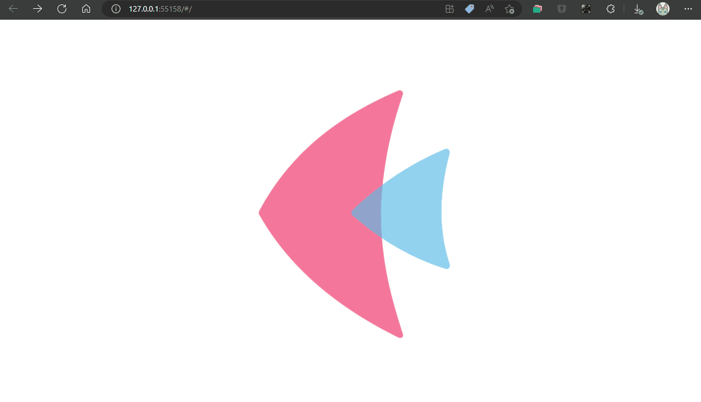

# Day01 Draggable & Resizable windows

Done
- Draggable 
- add winbox to wm
- click winbxo put on top layer (Active winbox)
- click close to remove winbox in wm 

Next:
- Draggable Border for resize winbox




## How to Run?
You can only copy my web.py to your dev-env
and run
```bash
flet .\web.py --web
```