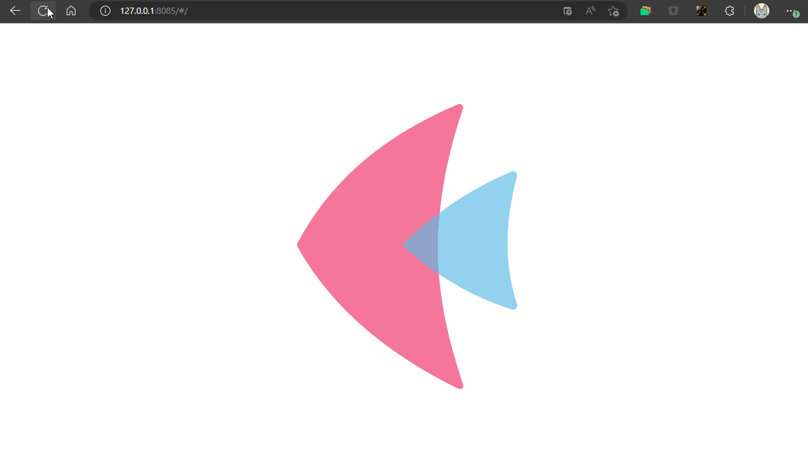

# Day02 TraysCtrl & WindowsCtrl with WM

Make Windows & Linux DM like Trays 
ans make TraysCtrl & WindowsCtrl

Done:
 - windwos minimize and tray win minimize 
 - windwos maximize and maximize back to last x/y/w/h
 - trys icon show active windows status
 - try icon show minimize status

web-demo : [http://mdi.flet.cyrix.tk/](http://mdi.flet.cyrix.tk/)



## How to Run?
You can only copy my web.py to your dev-env
and run
```bash
flet .\web.py --web
```

Flet-Lab/examples/Windows Theme MDI/